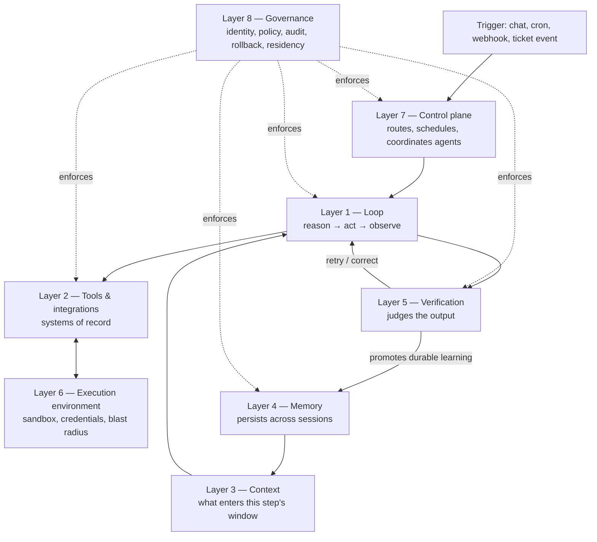

# Agent Harness Anatomy

**An eight-layer map for placing any agent product, platform, or business case on the same diagram.**

I kept running into the same problem when reading about agent platforms: every vendor describes its product with a different vocabulary, every analyst comparison is a feature checklist, and none of it tells you what you actually need to know — which parts of the stack you should own, and which you should rent. So I built a map. Every agent system I have looked at, open source or managed, decomposes into the same eight layers. Products differ mainly in *which layers they own*. A feature checklist tells you what a product can do; it doesn't tell you what you'd be renting versus owning if you bought it, which is the decision actually in front of you. This repo is that map, written out: eight layer briefs, a cross-platform comparison of eleven products and protocols, and a diagnostic for deciding what to build.

The argument, compressed:

1. Every agent system is built from the same eight layers. Vendors differ in which ones they bundle.
2. The **loop** (model calls a tool, observes the result, repeats) is a commodity. Coding harnesses perfected it first, because code comes with free verifiers: tests, compilers, linters.
3. Differentiation has moved up the stack to **memory**, **verification**, and **governance**. That is where every major platform shipped in 2026, and it is where lock-in forms.
4. An agent improves only as far as its **feedback signal** allows. Memory without a verifier compounds errors exactly as fast as it compounds skill.
5. For any business case the design work is the same: find the verifier, set the autonomy level it can support, own the layers that hold your proprietary knowledge, rent the rest.
6. The line between **agent autonomy and harness** keeps moving. Agents decide *what* to remember and do; once a primitive proves itself, the harness codifies *how* it happens — versioning, concurrency, permissions, deterministically. Knowing which side of that line a concern belongs on is most of harness design.

I apply this map to my own tooling work, and I publish it because the build-vs-buy conversation it enables is one most teams are currently having badly.

---

## How the layers connect

The table below places all eight side by side, but a request doesn't touch them side by side — it flows through them in a specific order, with governance enforcing itself at every boundary rather than taking a turn in the sequence. Solid arrows below are that flow; dotted arrows are governance.

**Reading it.** A trigger enters through the control plane (often not chat — see [Layer 7](docs/layers/07-control-plane.md)), which starts a loop. Each step of the loop pulls what it needs from context and calls out to tools, which execute inside a sandboxed execution environment. The loop's output goes to a verifier, which either sends a correction back into the loop or, once the same thing keeps working, promotes it into memory. Memory is what context draws on next time: that loop-back is the entire mechanism behind "an agent gets better." Governance doesn't occupy one step in the sequence — it enforces itself at every boundary shown, which is also why platforms cover it so unevenly. It has to be built into each layer separately; you can't bolt it on as a ninth box.

---

## The eight layers

| # | Layer | The problem it solves | Open source to study | Managed equivalents | The business-case question |
|---|-------|-----|---------------------|---------------------|---------------------------|
| 1 | [Loop](docs/layers/01-loop.md) | Run the reason → act → observe cycle; route models | OpenCode, OpenAI Agents SDK, Strands Agents, LangChain Deep Agents | AWS AgentCore managed harness, Claude Managed Agents, Microsoft Foundry hosted agents | None worth billing for: buy it. Only ask whether it is model-agnostic. |
| 2 | [Tools & integrations](docs/layers/02-tools-and-integrations.md) | Reach the systems of record | MCP servers, `SKILL.md` packaging | AgentCore Gateway, Foundry Toolboxes, hosted search/research APIs | Which systems of record, read or write, and who owns the credentials? |
| 3 | [Context](docs/layers/03-context.md) | Decide what enters the window on each step | OpenCode compaction and subagents, hybrid retrieval (BM25 + vector + literal) | Mostly implicit inside each runtime | What does a person doing this job need to know, and where does that live today? |
| 4 | [Memory](docs/layers/04-memory.md) | Carry learning across sessions | Hermes Agent, Letta, Mem0, Graphiti | Claude Managed Agents memory stores, AgentCore Memory, Vertex Memory Bank, Foundry memory | How often does the process repeat? Is there a method worth learning? |
| 5 | [Verification](docs/layers/05-verification.md) | Judge the output, and turn judgment into improvement | DSPy + GEPA, Inspect, Langfuse | Claude Managed Agents outcomes, Foundry Agent Optimizer | How cheaply and reliably can the output be checked? |
| 6 | [Execution environment](docs/layers/06-execution-environment.md) | Isolate compute, files, credentials | E2B, Daytona | AgentCore per-session microVMs, Foundry VM-isolated sandboxes, Modal / Cloudflare / Vercel / Runloop | What can the agent touch, and what is the blast radius? |
| 7 | [Control plane](docs/layers/07-control-plane.md) | Channels, routing, scheduling, teams, durability | OpenClaw, LangGraph, Temporal, A2A | Claude Managed Agents multiagent + webhooks, Foundry routines, AgentCore Runtime | One agent on one task, or a standing team across channels and schedules? |
| 8 | [Governance](docs/layers/08-governance.md) | Identity, policy, audit, rollback, residency | OpenTelemetry GenAI conventions, OWASP Agentic Top 10 | AgentCore Policy + Identity, Foundry Control Plane + ACS, Claude Managed Agents vaults and memory audit | What does a wrong action cost? Where must the data live? Who can erase it? |

---

## How to use this

**Reading for understanding.** Start with [`docs/layers/01-loop.md`](docs/layers/01-loop.md) and work up. Each layer brief leads with the problem, then the concepts worth owning, then the technology landscape (open source and managed, side by side), and closes with the one business-case question that layer answers. The layers are ordered bottom-up by dependency, but the interesting ones are 4, 5 and 8.

**Evaluating a platform.** Go to [`docs/framework-comparison.md`](docs/framework-comparison.md). Eleven products and protocols, scored by which layers they cover, with an explicit read of who each one is actually built for and where its real gap is.

**Scoping a project.** Go to [`docs/business-case-diagnostic.md`](docs/business-case-diagnostic.md). Five questions, an archetype grid, and an autonomy ladder. The short version: never climb above the autonomy rung your verifier can support.

**A note on freshness.** Vendor facts in this space decay in months. Everything here was verified against primary sources between 2026-09-11 and 2026-09-16, and dates are stated where they matter. Every hedge in this repo is deliberate — where a vendor's own claim is unaudited, or a feature is preview rather than GA, or a capability could not be confirmed against primary documentation, it says so. Re-verify anything you are about to put in front of a client or a board.

---

## License and about

Licensed [CC BY 4.0](LICENSE). Use it, adapt it, cite it.

Written by **Karsten Rieke**, a product leader working on the architecture and configuration of agentic tooling.
